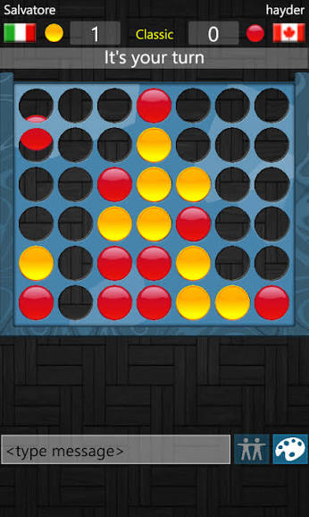
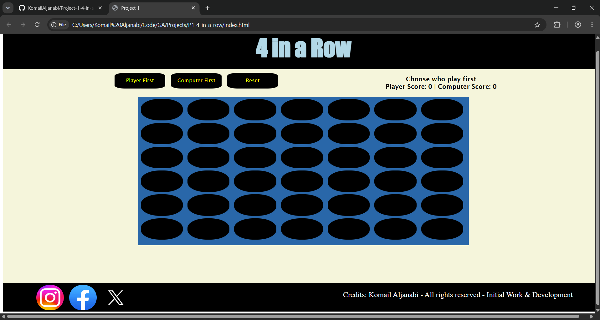
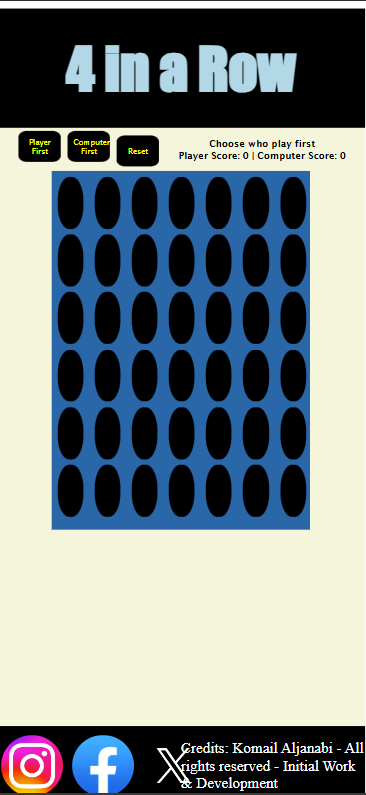

# Project 1: 4 in a Row Game

## Technologies Used
1. HTML
2. CSS
3. Javascript

## Description
**players will play classic 4 in a row game where each have a color of the coins to drop in the spaces to make a row of 4 of the same color you have before the other player.**

## User Stories
- I want to drop my coin from anywhere and it will get from top to bottom
- I want to choose who play first
- I want to choose the color of my coin
- I want to reset whenever during the game

## Screenshots
- The Model of the Game

- PC Version

- Mobile Version

## Credits
* **Komail Aljanabi** - *Initial Work & Development*
* Thank you to my course instructors for their guidance and mentorship.
* Thanks to my classmates for their feedback during testing.